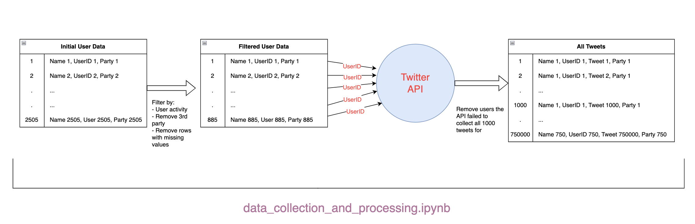
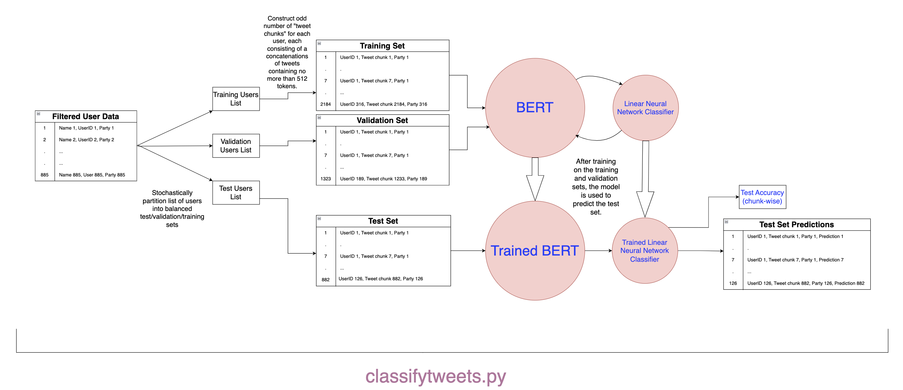
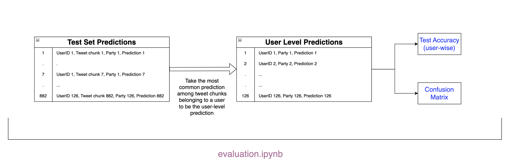

# Predicting the Political Affiliation of Twitter Users with BERT


Created by: Dustin Hayes, Francis Jo and Nicholas Mackay

## Table of Contents

- [Background](https://github.com/Djhayes72195/Political-Affiliation-with-BERT#background)

- [Potential Uses](https://github.com/Djhayes72195/Political-Affiliation-with-BERT#potential-uses)

- [Project Status](https://github.com/Djhayes72195/Political-Affiliation-with-BERT#project-status)

- [Installation Instructions](https://github.com/Djhayes72195/Political-Affiliation-with-BERT#installation-instructions)

- [Structure](https://github.com/Djhayes72195/Political-Affiliation-with-BERT#structure)

- [Reflection](https://github.com/Djhayes72195/Political-Affiliation-with-BERT#reflection)

- [Acknowledgements](https://github.com/Djhayes72195/Political-Affiliation-with-BERT#acknowledgements)

## Background

The purpose of this project is to train a BERT model to classify twitter users by political affiliation. It was initially created as the final project for STAT 766: Applied Data Mining/Machine Learning and Predictive Analytics at Kansas State University in the fall of 2022. The requirements for the final were developed for each group individually in conversation with the instructor: Dr. Haiyan Wang.  Beyond that we were to build a predictive model using machine learning, there were no particular requirements for the final that all groups needed to adhere to. As such, we were given a lot of agency in choosing what we wanted to build, and how to build it. Our choice to build a NLP classifier for political affiliation was a result of our interest in text data, politics, and the twitter API. This paper, https://ieeexplore.ieee.org/document/6113114, although outdated at this point (2011), served as a starting point for our inspiration.

The Python code used for the implementation of the BERT model itself was adapted from an article hosted on medium.com by Ruben Winastwan https://towardsdatascience.com/text-classification-with-bert-in-pytorch-887965e5820f, which is also a great introduction to BERT for those who are unfamiliar. All other code was written in Python by Dustin Hayes, Francis Jo and/or Nick Mackay. Development of this project is being continued by myself, Dustin Hayes.

## Potential Uses

The most straight-forward use case one might imagine is the targeting of political advertisements. A model such as ours could be utilized to identify and segment off a portion of the twitter user-base that the advertiser is interested in targeting.  For instance, an interested party who plans on using twitter to advertise content related to the upcoming Republican primary, or otherwise interact with potential voters, could use this model to target Republicans specifically. In this way, the advertiser could minimize the amount of money and/or time spent advertising to Democrats who, depending on the state in which they claim residency, are unlikely or unable to vote in the Republican primary anyway. We would like to note that, while twitter officially banned political advertisements around the beginning of 2020, twitter CEO Elon Musk has expressed his intention to allow them again https://www.nytimes.com/2023/01/03/technology/twitter-political-ads.html. 

Such a model could also allow for a more informative use of sentiment analysis in some contexts. Say that a researcher was interested in describing how a particular policy was being received on twitter using sentiment analysis. Let's also say that there is good reason to expect that the response to this policy will be substantially different among Democrats and Republicans. Attempting to perform sentiment analysis to evaluate the response to this policy in aggregate could obscure substantial differences across party lines. Our model could be used to partition the researcher's sample by party to better understand these differences, improving the researcher's characterization of public opinion as a whole.

There are many other possible uses that one could imagine. The ability to automatically classify the political preferences of a large number of social media users could potentially be useful in any study involving twitter data where the researcher wishes to include party affiliation as a latent variable.

## Project Status

This project is currently in development. The code here is capable of gathering tweets made by US politicians using the twitter API, cleaning and organizing the resulting data, training a BERT model on the gathered data, and evaluating the performance of the trained model on a test set.  ~750,000 tweets originating from US politicians, which we have already obtained using the twitter API, are included in the "Data" directory. Therefore, it is not necessary for an outside user to gather more tweets in order to explore our project. This method consistently achieves ~85% test accuracy on the included data at the user-level. There are, however, a number of limitations that I hope to address, and some functionality that I wish to add:

- For ease of labeling and analysis, we limited our scope to US politicians. The set of specific politicians we considered can be found in "Data\\Original_kaggle_dataset.csv", a  dataset we found on Kaggle that contained many user IDs corresponding to US politicians, as well as their declared party. It is my goal to expand our model to work on general population users. Discussion on how I hope to accomplish this can be found in [Reflection](https://github.com/Djhayes72195/Political-Affiliation-with-BERT/edit/main/README.md#reflection).

- There are computing limitations that I would like to address. We obtained ~750,000 tweets with the twitter API, but training on a single core with only a tenth of our data takes approximately 10 hours. I hope to learn more about threading and GPU computation to make training more practical.

- As of 1/31/2023, a trained model is committed and can be used to make predictions on chunks of text constructed from the tweets of the politicians we initially considered. I plan on writing a series of tests to perform on our trained model in model_interaction.ipynb, which is located in the root directory of this project. The only test I have written so far reports the accuracy of the trained model on a random sample of the same test data used to evaluate the model initially. I plan on developing methods to experiment with our model on both older and newer data generated by the same set of politicians we initially considered, and a relatively small sample of hand-labeled general population users. These experiments should offer some insight as to how often a model such as ours will need to be retrained, and how well it performs on non-politicians. Other experiments are likely to be devised and implemented in the future.

## Installation Instructions

In order for this project to clone properly, you will need to have the git large file storage (LFS) command line client installed. The following instructions on how to install git LFS were pulled from https://www.atlassian.com/git/tutorials/git-lfs#:~:text=Installing%20Git%20LFS,-There%20are%20three&text=Install%20Sourcetree%2C%20a%20free%20Git,run%20git%20lfs%20install%20once.

1. There are three easy ways to install Git LFS:

        a. Install it using your favorite package manager. git-lfs packages are available for Homebrew, MacPorts, dnf, and packagecloud; or

        b. Download and install Git LFS from the project website; or

        c. Install Sourcetree, a free Git GUI client that comes bundled with Git LFS.

2. Once git-lfs is on your path, run git lfs install to initialize Git LFS (you can skip this step if you installed Sourcetree):

```
git lfs install
```

You'll only need to run git lfs install once. Once initialized for your system, Git LFS will bootstrap itself automatically when you clone a repository containing Git LFS content.

Once Git LFS is installed, continue with the following steps. These instructions assume that you have Python 3.

1. Clone this repository to your local machine.

2. Navigate to this project.

```
cd <location_on_your_machine/Political-Affiliation-with-BERT>
```

3. Install requirements.

```
pip3 install -r requirements.txt
```

The next steps depend on what you would like to do. If you would like to train the model on previously collected data, run this command from the root directory. Keep in mind, however, that classifytweets.py takes a long time (~7 hours) to run. 

```
python classifytweets.py
```

If you would like to test our data collection/processing methods, evaluate the results of a previous run, or test our trained model, you will need a way to interact with Jupyter notebooks. If you don't already have a plan for doing that, you can run:

```
pip3 install jupyterlab
```

```
jupyter-lab
```

The last command should open up a page in your web browser where can you interact with the .ipynb files we used.

## Structure

The work required to recreate this project is handled by 3 different files. All files described here are located in the root directory.

### **data_collection_&_processing.ipynb**


*A Jupyter notebook we used to mine and process the text data we trained and tested our model with.* 

The starting point for the work carried out in data_collection_and_processing.ipynb is a Kaggle dataset containing the twitter user ID, name, and political party associated with 2505 twitter accounts belonging to US politicians. data_collection_and_processing.ipynb removes 3rd party politicians and inactive twitter accounts from consideration, gathers 1000 tweets from each account where possible, and assigns labels to those tweets. Finally, it constructs a csv where each row contains one of the tweets we want to consider, the user ID and political party associated with the tweet, and the tweet ID. We saved a csv which is the result of all of these operations on our previously gathered data at Data\\text_party_IDs.csv. Further instructions and explanation is included in markdown cells within data_collection_&_processing.ipynb.



### **classifytweets.py**

*A script that will automatically construct training, validation, and test sets with the data processed by data_collection_&_processing.ipynb, use that data to train and test a BERT model paired with a linear neural network classifier, and save the resulting predictions on the test set for later evaluation.*

Consider the starting point for this script to be the endpoint of data_collection_&_processing.ipynb: a csv containing all tweets we wish to consider. We will refer to this csv as "text_party_IDs.csv". classifytweets.py will first partition a list of user IDs represented in test_party_IDs.csv into balanced training, validation, and test groups with a 50/30/20 split. There are more Democrats than Republicans; we stochastically remove Democrats from the analysis at this juncture to ensure balance. Each resulting group of user IDs, assigned  to either the training, validation or testing, is then input as a list into a function that will construct a pandas dataframe as follows:

for each user ID:
1) Sort all tweets associated with this user ID by length (number of words).

2) In order of length, concatenate tweets from this user without replacement until a limit of 500 words would be exceeded by adding the next. 

3) Store this concatenation of tweets, which we call a "tweet chunk", and the political party of the user who generated it, as a row in the training/validation/test dataframe.

4) Repeat steps 2 and 3 until a predetermined number of tweet chunks has been reached. This number should be odd, as the chunks will vote to determine the user-level prediction.

The resulting training and validation dataframes are then used to train the BERT model in concert with a linear neural network classifier. Once the model is trained, each tweet chunk in the test set is run through the model and assigned a prediction. The results are then written in a csv under Data\\Raw_BERT_results for evaluation. Note that, at this point, we have generated predictions for tweet chunks, not users. 



### **evaluation.ipynb**

*A Jupyter notebook which can be used to generate a few simple metrics describing the performance of our model.*

After chunk-level predictions on a test set have been generated and saved to a csv, this file can be used to calculate chunk-level accuracy, user-level accuracy, and construct a confusion matrix. The original purpose of this project was to create a system that could classify users, not individual tweets or chunks of tweets. As such, calculation of user-level accuracy is perhaps the most important operation performed here. User level predictions are obtained by putting those tweet chunks belonging to a particular user to a vote. For example, if 4 of the 7 tweet chunks belonging to User 1 were predicted to be Democrat, the user-level prediction for User 1 is Democrat. User-level accuracy is then calculated as number of correct user-level predictions over total number of predictions. Further details are discussed in the markdown cells within evaluation.ipynb.




## Reflection

Our initial goal, in the most general sense, was to build a model that could take any twitter user ID as input (not just IDs belonging to politicians), and predict the political affiliation of the associated user based on some subset of their post history. Naturally, we ran into some complications that required us to modify our approach or limit our analysis in some way. Some of our more notable complications and the solutions/compromises that we proposed were:

### Problem: What is the best way to assign ground truth labels for general population users whose political affiliation is not public knowledge?

- Potential solution 1: We could use the twitter API to create a sample of users that reach some threshold of activity on twitter, manually inspect their tweets for political messaging, then hand label them as Democrat or Republican. We could also remove users without clear political leanings at this point.

- Drawbacks to solution 1: This would be a very laborious process. We would presumably need to inspect hundreds or thousands of users before constructing a suitably sized dataset.  Although not out of the question now that there is no deadline by which we need to complete this assignment, it would be best to avoid this sort of thing if we can.

- Potential solution 2: We could use the twitter API to construct a metric that could be used to identify users that almost certainly belong to one party or the other. Those users could be automatically labeled according to this metric and included in the analysis without the need for manual inspection. For instance, we could use the twitter API and a list of user IDs associated with well known political figures to calculate number of Democratic politicians followed divided by total number of politicians followed for a set of users, automatically labeling any users sufficiently close to 1 as a Democrat.

- Drawbacks to solution 2: This solution begs the question: "why would we need this model if we can use an easily calculable metric to classify users?". More investigation is required to answer this question completely. However, it is likely that, while there exists some subset of users that could be confidently identified as Democrat or Republican by who they follow, there are also users who display no such tendencies. In essence, this solution would use those users who can be easily identified without NLP to train a model to predict those users who can not be. I hope to explore this option in the future.

- Current solution: We were able to find a dataset containing the name, user ID, and declared party for a large number of US politicians. We chose to limit our analysis to those politicians so that we could work on developing our methodology and gaining experience with BERT before attempting to expand the system. This compromise is something that I hope to address in the future.

### Problem: How do we deal with users who don't post political content?  How about individual tweets that are not political in nature?

- Potential solution: We discussed developing a second layer of classification to determine if an individual tweet is likely to be political in nature before including it in our training data. We could use this classifier to help identify users whose tweets often contain political messaging so as to include them in our dataset. We could use the same classifier to filter out noisy tweets when making predictions on new users, or to conclude that an accurate prediction of a user's political affiliation is unlikely.

- Drawbacks: There are no real drawbacks to this solution besides the time commitment. It would be a big step towards expanding our model to work on general population users.

- Current solution: Limiting our scope to US politicians reduced the need for us to pursue this solution. Unsurprisingly, many of them tweet about politics almost exclusivly. One step that we took towards limiting the amount of non-political content in our model, which did result in a performance boost, was to give preference to the longest tweets first when constructing our test and training sets. We did so under the assumption that longer tweets were likely to be more analytical and therefore more likely to contain political messaging.

### Problem: BERT can only deal with up to 512 tokens at a time. How should we use BERT to make predictions on the user level, where more than 512 tokens should be considered?

- Potential solution 1: Train and test the model on individual tweets. Use the most common prediction among those tweets belonging to a particular user as the user level prediction.
Drawbacks: This seemed to be the most intuitive solution. We actually tried this solution before settling on an alternate method. For some reason that I still don't quite understand, the model performed worse and took longer to run when we attempted this solution.

- Current solution: Instead of training the model on individual tweets, we concatenated tweets belonging to a particular politician together while ensuring that the 512 token limit was not exceeded. We refer to these concatenations of tweets as "tweet chunks". The tweet chunks were labeled according to the user they originated from and used to train and test the model, and the most common prediction among the tweet chunks belonging to a particular politician are considered as the prediction for that politician. Using tweet chunks instead of individual tweets as our training data, we observed both faster runtimes and higher accuracy.  We are unsure as to why this approach seemed to work better.

### Other Reflections, Considerations and Limitations.

A big limiting factor for us was computing time. No one in the group had very much experience with such a computationally expensive problem. Depending on hyperparameter settings and the amount of data we used, training could take 6-10 hours or more. We managed to get around the long runtimes by taking advantage of the BEOCAT supercomputer at KSU. Using BEOCAT allowed us to run up to 10 to 15 instances of our code simultaneously to test different hyperparameter settings. Of all the combinations we tried, we eventually found that learning rate = 1e-6, epochs = 5, and batch size = 2 optimized our accuracy when training on around 80,000 tweets.

Finally, I hope to experiment with using a different classifier. We found the most success with a linear neural network. This seemed natural to us as BERT outputs quite a few (768) features to use as input for classification, and we did not encounter any serious overfitting issues that couldn't be addressed by reducing the number of epochs we trained over. Still, I think that it would be worthwhile to experiment with other classifiers.

I also hoped to address the evaluation metrics we chose to use, and our motivation for using them. We initially chose to report raw accuracy as opposed to F-1 score, recall, precision or the like because we tended to observe an approximately equal share of misclassified Democrats and Republicans. Furthermore, without considering the circumstances of a particular use case, there is no clear difference in harm associated with misclassifying a sample in one way or the other. That being said, I did observe a rather uneven split of misclassified samples on my most recent run (1/29/23), so I am likely to reassess the need for additional evaluation metrics in the near future.

Despite these limitations, compromises and unanswered questions, this was a very educational project for my team and I. We gained a great deal of experience with text data, data mining, data organization and processing, computationally expensive learning algorithms, supercomputing, and the BERT model itself. More than anything, we gained experience working on a machine learning problem from the absolute beginning. The structure, purpose, and direction of the project was a result of our own efforts, not provided to us by an instructor or defined in a Kaggle problem. It was also a fantastic experience to handle data collection ourselves instead of being handed a dataset. All things considered, my team and I very much enjoyed this project, and I am excited to continue working on it.

## Acknowledgements

I would like to thank Dr. Haiyan Wang and Dr. Lior Shamir for their guidance and willingness to answer questions concerning this project. I would also like to thank Ruben Winastwan for his guide on the BERT model which was so useful to us. I would also like to thank data scientist Dustin Solomon and machine learning engineer Caroline Binley for their feedback. Finally, I would like to thank my teammates Francis Jo and Nicholas Mackay for working on this with me.
